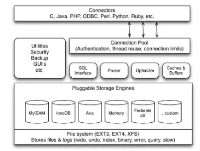

MariaDB Operator is a key technology for MariaDB cloud strategy that assists in creating MariaDB server and database easily by defining basic Custom Resource. This operator enables the customers to deploy MariaDB platform in a variety of database configurations in a Kubernetes environment. 

### Features of MariaDB Operator:

- Setup a MariaDB server with configured version.

- Create a custom database along with a user credential set for the custom database.

- Persistent Volume usage where MariaDB can write its data files.

- Seamless upgrades of MariaDB without loosing existing data.

- Take full backup of Database at user-defined location.

- Schedule backup at regular intervals.

- Monitor metrics for for MariaDB node.

### Architecture

### Objective of tutorial

In this tutorial,we are going to cover following topics:

- Install MariaDB Operator and verify its successful installation.
- Create an instance of MariaDB Operator and verify status of pods and services.
- Access MariaDB Instance and create database tables in MariaDB.
- Schedule backup of MariaDB at regular intervals.
- Enable Monitoring services on MariaDB Server using Prometheus and Grafana Operator.
- Cleanup the Operator resources.
